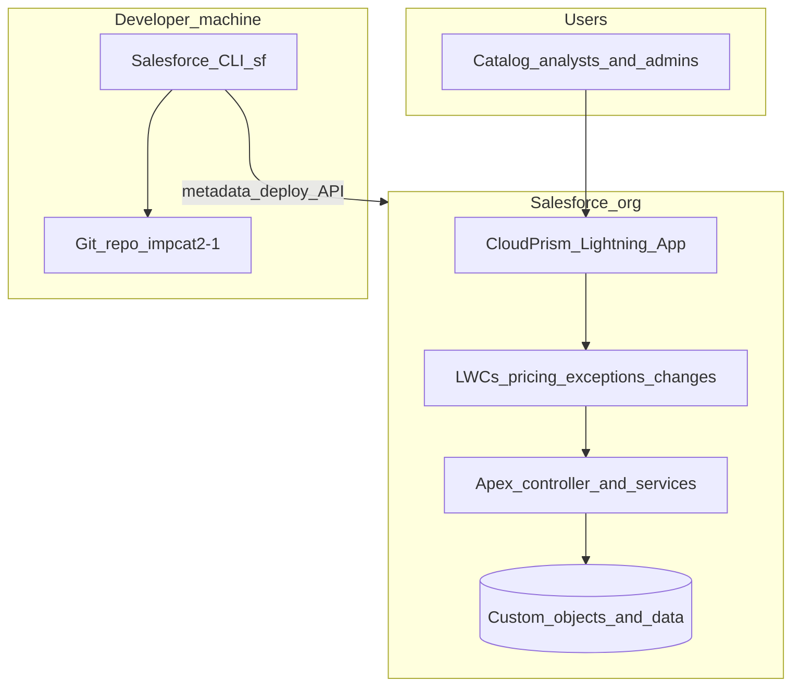
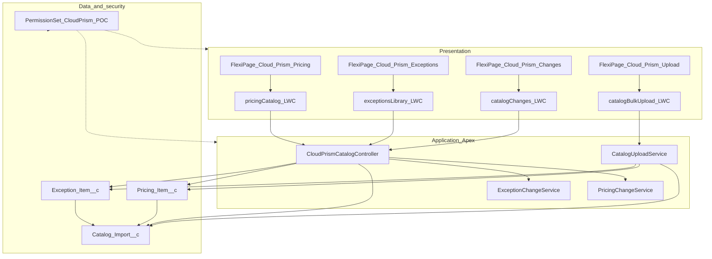
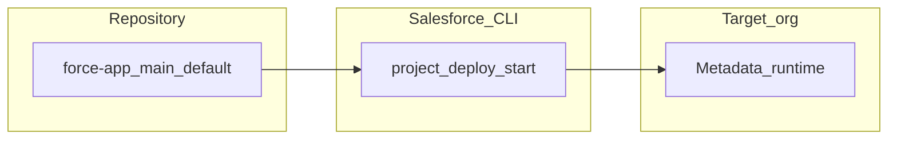

# Architecture — CloudPrism Salesforce POC

This repository implements a **Salesforce-native** slice of CloudPrism: **pricing catalog**, **exceptions library**, and **month-over-month catalog changes** (diffs). It is **not** the Node/Postgres full stack; it can run **in parallel** as a POC or future system of record for catalog data.

## High-level system context

**Future (not in repo):** MuleSoft, SharePoint, or other ETL can **insert** rows via Bulk/REST API; that path is external to this codebase.

## Layers inside the org

## Component inventory

| Layer | Artifact | Responsibility |
|-------|----------|----------------|
| App | `CloudPrism` | Lightning app with tabs for Pricing, Exceptions, Changes, Bulk upload |
| UI | `pricingCatalog` | Datatable, CSP filter, search; wires `getPricingItems` |
| UI | `exceptionsLibrary` | Datatable, CSP filter, search; wires `getExceptionItems` |
| UI | `catalogChanges` | Month pickers, pricing vs exceptions mode, CSP and change-type filters; wires `getDistinctImportMonths`, `getCatalogChangeRows` |
| UI | `catalogBulkUpload` | Multi-file CSV picker; sequential `CatalogUploadService.processFile` calls; results table |
| API | `CloudPrismCatalogController` | `@AuraEnabled(cacheable=true)` read endpoints; dynamic SOQL for list views |
| API | `CatalogUploadService` | `@AuraEnabled` CSV ingest; filename `{YYYY-MM}_{csp}_{schema}.csv`; row/size guardrails |
| Domain | `PricingChangeService` | Build latest snapshot per month; compare two months; emit DTOs (`added` / `removed` / `updated`) |
| Domain | `ExceptionChangeService` | Same pattern for exceptions |
| Quality | `CloudPrismCatalogTest` | Apex tests for diff behavior and controller wiring |
| Quality | `CatalogUploadServiceTest` | Filename parsing, CSV ingest, validation, and limits |
| Access | `CloudPrism_POC` | Object CRUD, tab visibility, Apex class access, FLS on optional custom fields |
| Seed | `scripts/sample-data.apex` | Anonymous Apex demo data (multi-CSP, two months) |

Source paths live under [`force-app/main/default/`](../force-app/main/default/).

## Security model (POC)

- **Apex** uses `with sharing`; CRUD/FLS enforced for the running user where applicable.  
- **Permission set** `CloudPrism_POC` grants access to the three custom objects, Lightning tabs, the CloudPrism app, and Apex classes including `CatalogUploadService`. Optional custom fields have explicit **field permissions** where listed (required fields and master-detail columns are not duplicated in the permission set metadata per Salesforce rules).  
- **Anonymous Apex** (`sample-data.apex`) compiles against the **user’s** field visibility; assign the permission set to avoid “field does not exist” compile errors.

## Catalog changes algorithm (summary)

For each **import month** and **schema** (pricing or exceptions):

1. Query all child rows whose parent `Catalog_Import__c` matches that month and schema.  
2. Order by parent `Imported_At__c` descending (tie-breakers: `CreatedDate`, `Id`).  
3. Walk the list and keep the **first** row per natural key:  
   - Pricing: `(CSP__c, Catalog_Item_Number__c)`  
   - Exceptions: `(CSP__c, Exception_Unique_Id__c)`  
4. Build two maps for **month from** and **month to**; union keys; classify **added**, **removed**, **updated**; apply optional CSP and change-type filters.

Details and field-level “what counts as updated” are in Apex source and in [FLOWS.md](./FLOWS.md).

## Deployment topology (metadata)

[`sfdx-project.json`](../sfdx-project.json) sets `sourceApiVersion` **62.0**; the org may accept deployment via a higher platform API version.

## Out of scope (POC)

- Services / **parent** catalog grid and enrichment  
- Cloud calculator  
- IGCE, Redis, Node workers  
- **Large-catalog** automated ingest (MuleSoft / Bulk API 2.0) beyond the [MULESOFT_CATALOG_INGEST.md](./MULESOFT_CATALOG_INGEST.md) outline  
- Precomputed change-log objects (diffs are **on read**)

## Related documents

- [DATA_MODEL.md](./DATA_MODEL.md) — fields and relationships  
- [FLOWS.md](./FLOWS.md) — sequence and flow diagrams  
- [DEPENDENCIES_AND_TOOLING.md](./DEPENDENCIES_AND_TOOLING.md) — stock Salesforce vs local CLI  
