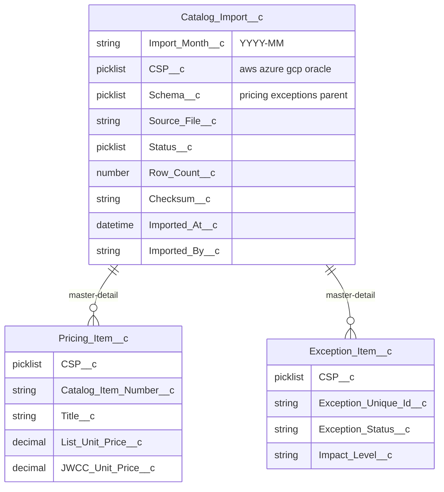

# Data model

## Entity relationship (conceptual)

`Pricing_Item__c` and `Exception_Item__c` are **master-detail** children of `Catalog_Import__c` (sharing is controlled by parent).

## `Catalog_Import__c` — import header

One row per **logical file** / snapshot: a combination of **month**, **CSP**, and **schema** (pricing vs exceptions). The **Bulk upload** tab and `CatalogUploadService` can create headers from files named `{YYYY-MM}_{csp}_{schema}.csv`; for `parent` schema they insert the header only (no child rows in POC). Other loads may use Data Loader, Bulk API, or `scripts/sample-data.apex`.

| Field (API) | Purpose |
|-------------|---------|
| `Import_Month__c` | Text `YYYY-MM` identifying the catalog month |
| `CSP__c` | `aws`, `azure`, `gcp`, `oracle` |
| `Schema__c` | `pricing`, `exceptions`, or `parent` (reserved) |
| `Source_File__c` | Original filename (operational traceability) |
| `Status__c` | e.g. `pending`, `processing`, `done`, `error` |
| `Row_Count__c` | Expected or reported row count |
| `Checksum__c` | Optional file checksum |
| `Imported_At__c` | Used to pick **latest** import when multiple rows exist for the same month (see diff logic) |
| `Imported_By__c` | Who or what ran the import |

`Name` is **auto-number** (e.g. CI-{000000}).

## `Pricing_Item__c` — pricing line

Child of a **pricing** schema import. Diff logic keys rows by **`CSP__c` + `Catalog_Item_Number__c`** (case-normalized) within each month.

Notable fields: `Title__c`, `CSO_Short_Name__c`, `Description__c` (long text), `List_Unit_Price__c`, `JWCC_Unit_Price__c`, `Pricing_Unit__c`, `JWCC_Unit_Of_Issue__c`, `Discount_Premium_Fee__c`, `Focus_Category__c`, `Service_Category__c`.

## `Exception_Item__c` — exception line

Child of an **exceptions** schema import. Diff logic keys by **`CSP__c` + `Exception_Unique_Id__c`**.

Notable fields: `CSO_Short_Name__c`, `Impact_Level__c`, `Exception_Status__c`, long-text PWS / basis / security fields.

## Uniqueness

The POC does **not** rely on Salesforce duplicate rules for composite keys. **Apex** assumes one “winning” row per key per month by ordering on `Catalog_Import__r.Imported_At__c` (then `CreatedDate`, `Id`). Operational loads should avoid overlapping ambiguous duplicates for the same month/CSP/schema if you want stable diffs.

## Sample data

[`scripts/sample-data.apex`](../scripts/sample-data.apex) seeds multiple CSPs and two months. See root [README.md](../README.md).
