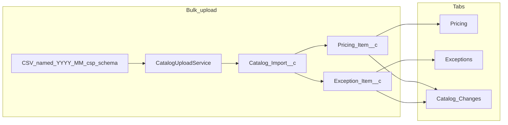

# CloudPrism POC — end-to-end walkthrough

This document describes how the app works from first login through data load, browsing, and month-over-month diffs. For diagrams and API-level sequences, see [FLOWS.md](./FLOWS.md). For objects and fields, see [DATA_MODEL.md](./DATA_MODEL.md).

---

## 1. Prerequisites

- Deploy metadata to a dev or scratch org (`sf project deploy start --source-dir force-app`).
- Assign the **CloudPrism_POC** permission set to your user (object access, tabs, Apex classes, relevant FLS).
- Open the **CloudPrism** app from the App Launcher.

Without the permission set, LWCs and Anonymous Apex that touch optional fields may fail. See the root [README.md](../README.md).

---

## 2. What you open (four tabs)

| Tab | LWC | Main Apex |
|-----|-----|-----------|
| **Pricing** | `pricingCatalog` | `CloudPrismCatalogController.getPricingItems` |
| **Exceptions** | `exceptionsLibrary` | `CloudPrismCatalogController.getExceptionItems` |
| **Catalog Changes** | `catalogChanges` | Controller + `PricingChangeService` / `ExceptionChangeService` |
| **Bulk upload** | `catalogBulkUpload` | `CatalogUploadService.processFile` |

Component map: [ARCHITECTURE.md](./ARCHITECTURE.md).

---

## 3. Data model (mental model)

- **`Catalog_Import__c`** — One record per **logical import file**: **`Import_Month__c`** (`YYYY-MM`), **`CSP__c`** (`aws`, `azure`, `gcp`, `oracle`), **`Schema__c`** (`pricing`, `exceptions`, `parent`).
- **`Pricing_Item__c`** — Master-detail child for **pricing** imports. Diff natural key: **`CSP__c` + `Catalog_Item_Number__c`** (normalized in Apex).
- **`Exception_Item__c`** — Master-detail child for **exceptions** imports. Diff natural key: **`CSP__c` + `Exception_Unique_Id__c`**.

Header fields such as **`Imported_At__c`**, **`Row_Count__c`**, **`Status__c`**, **`Source_File__c`** support operations and “latest import wins” logic. Details: [DATA_MODEL.md](./DATA_MODEL.md).

---

## 4. Getting data in: Bulk upload (typical path)

**Demo order:** load an **earlier month** first, then a **later month**, so **Catalog Changes** can compare two months.

1. Open **Bulk upload**.
2. Select one or more CSV files. The LWC reads each file in the browser and calls Apex **sequentially** (`processFile` with `fileName` and `csvBody`).
3. **Filename contract:** `{YYYY-MM}_{csp}_{schema}.csv`  
   Example: `2026-01_aws_pricing.csv` → month `2026-01`, CSP `aws`, schema `pricing`. A bad name fails before any useful insert.
4. Apex **inserts a `Catalog_Import__c` header** first, then processes the body.
5. **`parent` schema** (`*_parent.csv`): only the header is stored; CSV data rows are **not** imported in this POC (message explains skipped lines).
6. **`pricing` / `exceptions`:**
   - Parse the CSV header row and map columns to allowed API names (pricing also supports a small set of aliases, e.g. commercial list price).
   - For each data row: construct `Pricing_Item__c` or `Exception_Item__c`, set **`Catalog_Import__c`** and **`CSP__c`** from the filename.
   - **Pricing only:** **`FinOpsFocusCategory`** sets **`Focus_Category__c`** from explicit focus/service/category columns and/or title, short name, and description.
   - **Skip unchanged:** If a **prior** `Catalog_Import__c` exists for the same CSP and schema with **`Import_Month__c` strictly before** this file’s month, Apex loads a **baseline snapshot** for that prior month (same CSP). Rows whose natural key and **compared fields** match the baseline (same rules as the diff engine) are **not inserted**; the result includes a **skipped** count. First month for that CSP+schema still inserts all valid rows.
   - Valid rows are inserted in batches. The header’s **`Row_Count__c`** reflects **inserted** rows only; **`Status__c`** is `done` or `error` if validation/DML errors occurred.
7. The UI shows success, rows inserted, skipped (unchanged), Catalog import Id, and messages/errors per file.

**Limits:** In-app upload caps file size and row count (see `CatalogUploadService`). Very large catalogs are intended for Bulk API / integration: [MULESOFT_CATALOG_INGEST.md](./MULESOFT_CATALOG_INGEST.md).

**Storage shape:** The **latest** month in the org may be **delta-only** (unchanged lines omitted). **Pricing** and **Exceptions** tabs show **only stored rows** for the filters you use—not a merged full catalog across months.

---

## 5. Browsing: Pricing and Exceptions

1. User opens **Pricing** or **Exceptions**.
2. The LWC calls **`getPricingItems`** or **`getExceptionItems`** with CSP, optional search, and limits.
3. The controller queries child records (and parent import) with dynamic SOQL as implemented.
4. **Search** only targets fields that are practical in SOQL `WHERE` (e.g. title, catalog number, short name); long text fields may be excluded from the filter predicate. See [FLOWS.md](./FLOWS.md) §1–2.

---

## 6. Catalog Changes (month-over-month)

1. Choose **Pricing** vs **Exceptions**, then **from month** and **to month** (from distinct import months for that schema).
2. Optionally filter by **CSP** and **change type** (added / removed / updated).
3. The controller calls **`PricingChangeService.compare`** or **`ExceptionChangeService.compare`**.

**Algorithm (summary):**

- Load child rows for each month (that schema).
- For each natural key, keep the **winning** row: order by parent **`Imported_At__c`** descending, then **`CreatedDate`**, **`Id`**—first row per key wins. See [ARCHITECTURE.md](./ARCHITECTURE.md).
- Build maps keyed like `csp|catalogNumber` or `csp|exceptionId`.
- **Union keys:** present only in “to” → **added**; only in “from” → **removed**; in both → if compared fields differ → **updated**; if same → omitted from the grid.

**Pricing “updated”** uses: JWCC unit price, commercial list price, discount/premium string, JWCC unit of issue, pricing unit (not title).

**Exceptions “updated”** uses: impact level, status, PWS requirement, basis, security, CSO short name.

Diffs are computed **on read**; there is no separate change-log custom object. More detail: [FLOWS.md](./FLOWS.md) §3.

---

## 7. End-to-end demo narrative

1. **Bulk upload** January pricing and exceptions → snapshots under `2026-01` (and full insert when no prior month).
2. **Bulk upload** February files → new headers; unchanged lines may be skipped; new/changed lines inserted.
3. **Pricing / Exceptions** → inspect what is **actually stored** per month/CSP.
4. **Catalog Changes** → Jan vs Feb → **added**, **removed**, **updated** aligned with the same field rules as import skip logic.

---

## 8. Other ways to load or reset data

| Mechanism | Role |
|-----------|------|
| **`scripts/sample-data.apex`** | Anonymous Apex demo seed (multi-CSP, two months). Avoid re-running without removing old demo rows if you need a clean month grid. |
| **`scripts/purge-all-catalog-uploads.apex`** | Deletes all `Pricing_Item__c`, `Exception_Item__c`, and `Catalog_Import__c` (with recycle bin empty) to reclaim storage. |
| **Data Loader / Bulk API** | Alternative insert path: create **`Catalog_Import__c`** parents first, then children with **`Catalog_Import__c`** set. Skip-unchanged behavior exists only in **`CatalogUploadService`** unless you replicate it. |

---

## 9. Out of scope (this POC)

- No in-repo MuleSoft automation (outline only in [MULESOFT_CATALOG_INGEST.md](./MULESOFT_CATALOG_INGEST.md)).
- No “merge prior month into current” in Pricing/Exceptions browse views.
- No Cloud calculator, IGCE, Node/Postgres stack—this org is the Salesforce slice only.

---

## Related docs

- [ARCHITECTURE.md](./ARCHITECTURE.md) — layers and security  
- [FLOWS.md](./FLOWS.md) — sequence and flow diagrams  
- [DATA_MODEL.md](./DATA_MODEL.md) — fields and relationships  
- [README.md](../README.md) — deploy, tests, bulk-upload summary  
