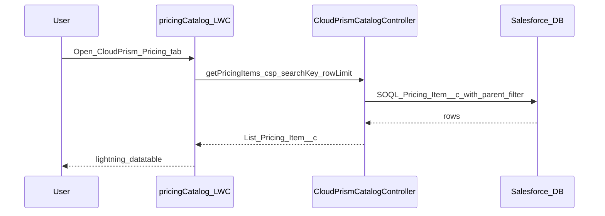
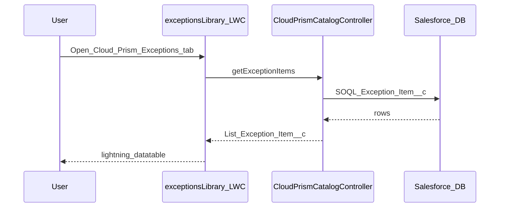
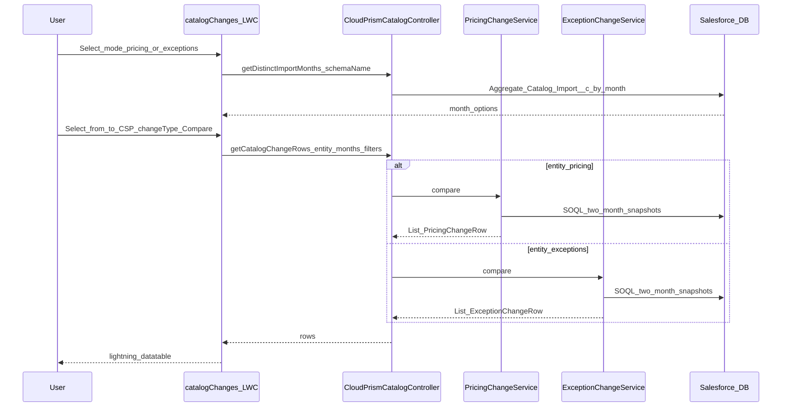
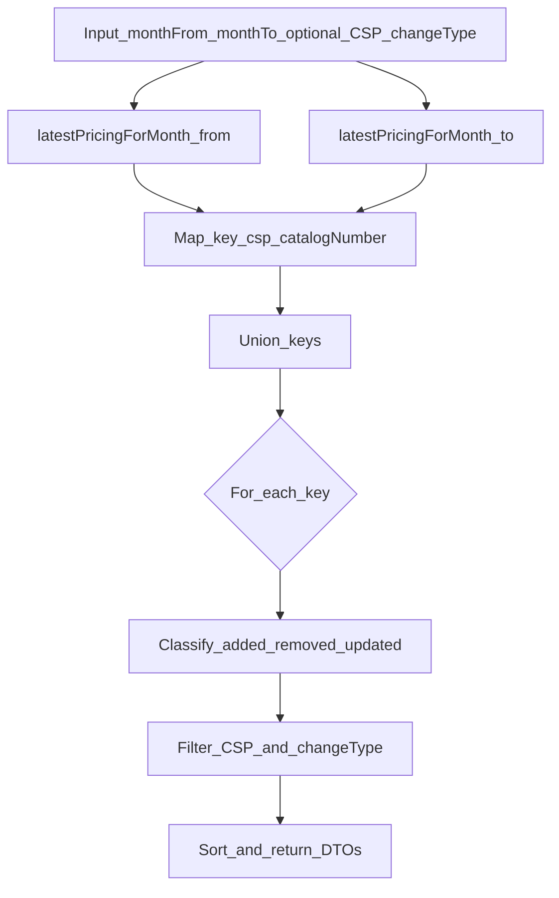
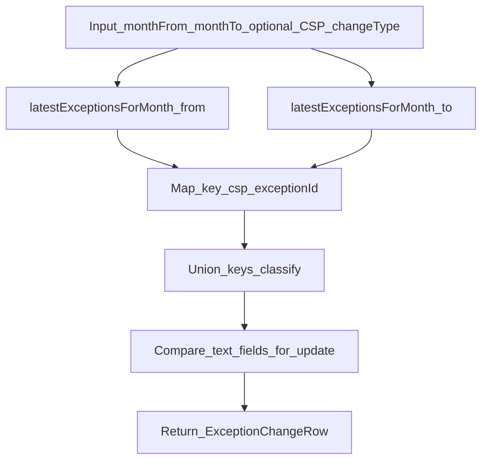
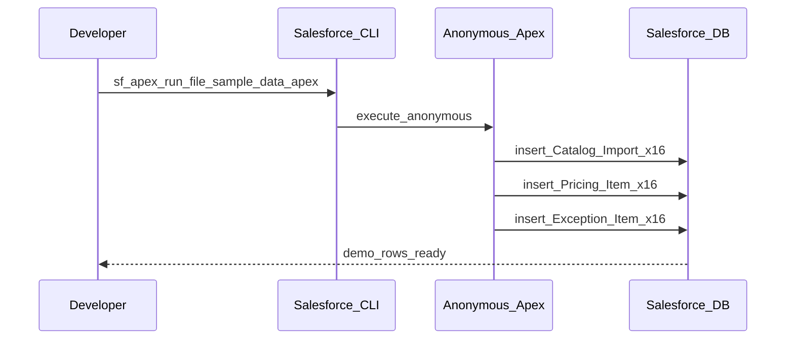
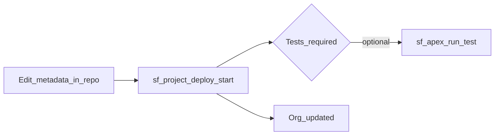
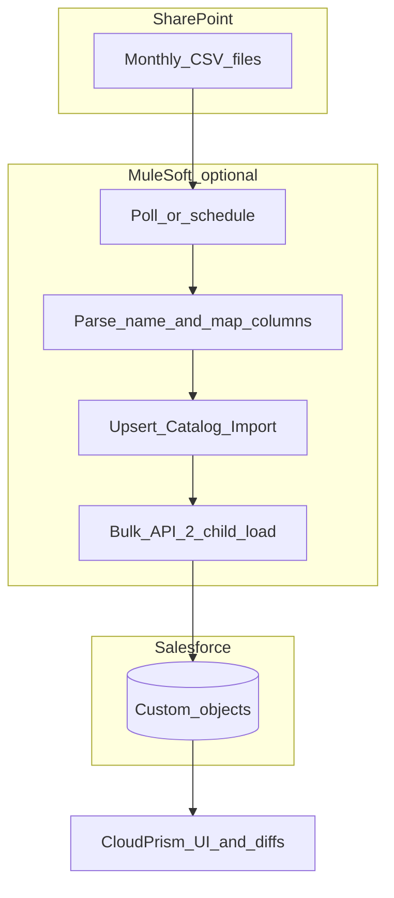

# Operational flows (with diagrams)

## 1. User opens Pricing Catalog

Search applies to **Title**, **Catalog_Item_Number**, **CSO_Short_Name** only (long text fields are not filterable in SOQL `WHERE`).

---

## 2. User opens Exceptions Library

Same pattern as pricing, with `getExceptionItems` and `Exception_Item__c`; search excludes long-text PWS/basis/security columns from the `WHERE` clause.

---

## 3. Catalog Changes — load months and diff grid

### Internal diff pipeline (pricing)

**Updated (pricing)** when any of these differ between months: JWCC price, commercial list price, discount/premium string, JWCC unit, commercial unit.

### Internal diff pipeline (exceptions)

**Updated (exceptions)** when impact level, status, PWS, basis, security, or CSO short name differ.

---

## 4. Sample data load (developer)

Requires **CloudPrism_POC** (or equivalent FLS) on the running user. Re-running duplicates headers unless old demo trees are deleted.

---

## 5. Metadata deploy (CI or laptop)

---

## 6. Target production-style load (future — not implemented in repo)

This integration is **architectural** only; implement MuleSoft (or another ETL) separately.
